# 01 — Individual Problem Scan

## Scan rộng

Quân scan 10 problems, vượt má»c tối thiểu 5.

| # | Lăng kính | Problem quan sát được | Ai đang đau? | Dấu hiệu thật |
| :--- | :--- | :--- | :--- | :--- |
| **1** | Tốn thời gian | Thuê đồ đạc ngắn hạn (lều trại, máy ảnh) gặp khó vì Việt Nam chưa có app thuê đồ tập trung, phải tìm thủ công. | Người cần thuê đồ | Mất 1-2 ngày đăng bài lên Facebook, inbox hỏi giá từng người, rủi ro lừa đảo mất tiền cọc cao. |
| **2** | AI có thể tốt hÆ¡n | Đọc hợp đồng thuê nhà hoặc điều khoản dịch vụ (ToS) dài 5-7 trang toàn chữ. | Người thuê nhà / Người dùng | Mất 30 phút đọc nhÆ°ng không hiểu các từ ngữ pháp lý, đành ký bừa rồi mang cục tá»c nếu có tranh chấp. |
| **3** | Lặp lại | Ghi chÃp chi tiêu hàng ngày vào app quản lý tài chính nhÆ°ng lười, hay quên. | Sinh viên / Người đi làm | Cuối tháng nhìn số dÆ° trong bank lệch hẳn so với app, tra lại không nhớ mình đã tiêu khoản gì. |
| **4** | Pain từ người khác | Hẹn lịch họp nhóm bài tập hoặc đi chÆ¡i mà mỗi đá»a rảnh một khung giờ khác nhau. | Trưởng nhóm / Người tổ chá»c | Chat qua lại mấy chục tin nhắn trong group chat, cãi nhau cả buổi vẫn chÆ°a chốt được ngày. |
| **5** | Tốn thời gian | Chia tiền ăn uống, đi chÆ¡i cho nhóm đông (người chuyển khoản, người đưa tiền mặt, người trả hộ). | Người đá»ng ra thanh toán | Ngồi lướt lịch sá»­ bank, cộng trừ nhân chia mất 30 phút. Cuối cùng tính sai vẫn bị hụt tiền. |
| **6** | Pain từ người khác | Bố mẹ ở quê gọi điện nhờ sửa lỗi điện thoại/TV nhưng chỉ miêu tả "nó hiện cái bảng gì ấy". | Con cái / Người trẻ | Phải video call, chỉ từng nút bấm qua màn hình rất mờ, mất 20-30 phút mới xong một lỗi vặt. |
| **7** | AI có thể tốt hơn | Tìm lại một email hoặc file tài liệu cŠlẫn trong đống mail quảng cáo, spam. | Sinh viên / Dân văn phòng | Gõ keyword vào ô search mà nó ra hàng loạt mail không liên quan. Lướt tìm mất 15 phút. |
| **8** | Tốn thời gian | So sánh giá, check xem review nào là thật trên Shopee/Lazada trước khi mua đồ điện tử. | Người mua hàng online | Lướt qua 4-5 shop, đọc comment mỏi mắt mất hơn 1 tiếng đồng hồ mà vẫn sợ mua nhầm hàng rởm. |
| **9** | Lặp lại | NghÄ xem "hôm nay ăn gì" dá»±a trên mớ nguyên liệu linh tinh còn sót lại trong tủ lạnh. | Sinh viên ở trọ / Nội trợ | Mở tủ lạnh đá»ng nhìn 15 phút mỗi chiều, lướt Tóp Tóp tìm công thá»c mất thêm 20 phút nữa. |
| **10** | Tốn thời gian | Điền form xin nghỉ phÃp bằng giấy/Word rồi chạy đi xin chữ ký các sếp. | Nhân viên văn phòng | Cầm tờ giấy chạy 2-3 phòng ban. Sếp đi họp là đơn bị ngâm cả tuần, mất công chat hỏi liên tục. |

## Top 3

| Rank | Problem | Vì sao chọn | Điều còn chưa chắc |
| :--- | :--- | :--- | :--- |
| 1 | Thuê đồ đạc ngắn hạn (Rento) | Workflow tìm đồ -> hỏi giá -> cọc rất rõ. Nỗi đau lớn (mất thời gian, mất tiền). | Bài toán xây dựng Platform, không thuần AI-first. Cần xác định rõ AI sẽ nằm ở bước nào. |
| 2 | Đọc hợp đồng/ToS | Hợp thế mạnh xử lý ngôn ngữ AI. Metric đo đạc rõ ràng (30 phút -> 2 phút). | Rủi ro pháp lý cao, ảo tưởng (hallucination) có thể làm người dùng thiệt hại. |
| 3 | Quản lý chi tiêu | Vấn đề lặp lại hàng ngày. AI trích xuất biên lai tốt hÆ¡n nhiều so với thủ công. | Rủi ro bảo mật (đọc SMS/Banking). Má»c độ chính xác nếu ảnh mờ/viết tắt. |

# 🃏 Problem Card #1 — Thuê đồ đạc ngắn hạn (Rento)

## Problem

> Người có nhu cầu thuê đồ đạc ngắn hạn mất 1–2 ngày tìm kiếm trên Facebook, phải hỏi giá thủ công và chịu rủi ro lừa đảo tiền cọc cao.

---

## Actor

Người cần thuê đồ ngắn hạn — sinh viên, người đi làm.

## Bối cảnh

Khi cần đồ đạc (máy ảnh, lều trại, ...) cho một sá»± kiện nhÆ°ng mua đá»t thì lãng phí.

---

## Current Workflow

| # | Bước | Thời gian |
|---|------|-----------|
| 1 | Đăng bài lên group Facebook | 10' |
| 2 | ⚠️ **Chờ người cho thuê thấy bài và phản hồi** | **1440'** |
| 3 | Inbox hỏi giá, thương lượng | 60' |
| 4 | Chuyển cọc thủ công | 5' |
| 5 | Hẹn điểm lấy đồ | 120' |
| | **Tổng** | **1635'** |

---

## Bottleneck

**Bước 2** — chờ người cho thuê thấy bài và phản hồi mất **1440 phút** (1–2 ngày), rủi ro mất cọc **100%** nếu gặp lừa đảo.

---

## Impact

- ⏱ Mất 1–2 ngày chỉ để chốt thuê một món đồ
- 💸 Tỉ lệ bị lừa đảo cọc cao, không có cơ chế bảo vệ
- 😤 Trải nghiệm thuê đồ rất tệ, thiếu tin tưởng

---

## Success Metrics

| Chỉ số | Hiện tại | Mục tiêu |
|--------|----------|----------|
| Thời gian từ tìm → chốt thuê | 1–2 ngày | **< 5 phút** |
| Tỉ lệ giao dịch an toàn | Thấp | **100%** |

---

## Non-AI Alternative

Xây dựng **nền tảng trung gian** kết hợp **Smart Locker**, công khai giá niêm yết và giữ tiền cọc qua hệ thống — không cần AI vẫn giải quyết được bottleneck chính.

## AI Hypothesis

> AI phân tích nhu cầu và giỏ hàng để **tự động gợi ý combo đồ liên quan**
> — ví dụ: thuê máy ảnh → gợi ý thêm pin dự phòng, túi đựng.

**Quick gut:** Giải pháp cốt lõi nằm ở **Workflow**, AI là lớp giá trị thêm phía trên.

---

## Workflow Comparison

### Current State — 1635 phút

```mermaid
flowchart LR
    A["📢 Đăng bài FB\n10'"]
    --> B["⚠️ Chờ phản hồi\n1440'"]
    --> C["💬 Inbox hỏi giá\n60'"]
    --> D["💸 Chuyển cọc\n5'"]
    --> E["📍 Hẹn lấy đồ\n120'"]

    style B fill:#ffb3b3,stroke:#d32f2f,stroke-width:3px,color:#7f0000
```



### Future State — 9 phút


> 💜 **Giảm 99.4% thời gian chờ. Giao dịch an toàn 100%.**

---
---

# 🃏 Problem Card #2 — Đọc hợp đồng / ToS

## Problem

> Người dùng phổ thông mất 30–60 phút đọc một hợp đồng hoặc điều khoản dịch vụ dài, không hiểu hết thuật ngữ pháp lý và dễ bỏ sót các điều khoản bất lợi.

---

## Actor

Người dùng cá nhân — freelancer, sinh viên, người đi làm ký hợp đồng lao động, hợp đồng thuê nhà, hoặc đồng ý ToS khi đăng ký dịch vụ.

## Bối cảnh

Khi cần ký hợp đồng hoặc chấp nhận điều khoản dịch vụ nhưng không có nền tảng pháp lý, không có tiền thuê luật sư cho các vụ việc nhỏ.

---

## Current Workflow

| # | Bước | Thời gian |
|---|------|-----------|
| 1 | Nhận / tải hợp đồng về | 2' |
| 2 | ⚠️ **Đọc toàn bộ văn bản, tra từng thuật ngữ** | **45'** |
| 3 | Highlight các điều khoản đáng ngờ | 15' |
| 4 | Hỏi bạn bè / Google để hiểu nghÄa | 20' |
| 5 | Quyết định ký hoặc thương lượng | 10' |
| | **Tổng** | **92'** |

---

## Bottleneck

**Bước 2** — đọc và hiểu văn bản pháp lý dài, ngôn ngữ chuyên môn, mất **45 phút** và vẫn có nguy cÆ¡ bỏ sót điều khoản bất lợi áºn sâu trong tài liệu.

---

## Impact

- ⏱ Mất gần 1,5 tiếng cho một hợp đồng đơn giản
- ⚠️ Dễ bỏ qua điều khoản phạt, tự động gia hạn, giới hạn trách nhiệm
- 😰 Cảm giác bất an khi ký vì không chắc mình hiểu đúng

---

## Success Metrics

| Chỉ số | Hiện tại | Mục tiêu |
|--------|----------|----------|
| Thời gian hiểu nội dung hợp đồng | ~45 phút | **< 2 phút** |
| Tỉ lệ phát hiện điều khoản rủi ro | Thấp (dựa vào may mắn) | **> 90%** |

---

## Non-AI Alternative

Xây dá»±ng thÆ° viện template hợp đồng chuáºn hoá kèm chú thích từng điều khoản — người dùng so sánh hợp đồng nhận được với template để phát hiện điểm khác biệt.

## AI Hypothesis

> AI đọc toàn bộ hợp đồng và **tóm tắt các điều khoản quan trọng, gắn nhãn má»c độ rủi ro** (xanh / vàng / đỏ), dịch thuật ngữ pháp lý sang ngôn ngữ thông thường trong dưới 2 phút.

**Quick gut:** Đây là **thế mạnh cốt lõi** của AI xá»­ lý ngôn ngữ — metric đo đạc rõ ràng. Rủi ro chính là hallucination có thể khiến người dùng bỏ sót điều khoản quan trọng hoặc hiểu sai nghÄa pháp lý.

---

## Workflow Comparison

### Current State — 92 phút

```mermaid
flowchart LR
    A["📄 Nhận hợp đồng\n2'"]
    --> B["⚠️ Đọc & tra thuật ngữ\n45'"]
    --> C["🖊️ Highlight rủi ro\n15'"]
    --> D["🔍 Hỏi Google/bạn bè\n20'"]
    --> E["✍️ Quyết định ký\n10'"]

    style B fill:#ffb3b3,stroke:#d32f2f,stroke-width:3px,color:#7f0000
```



### Future State — 4 phút

```mermaid
flowchart LR
    F["📤 Upload hợp đồng\n1'"]
    --> G["🤖 AI tóm tắt & gắn nhãn rủi ro\n2'"]
    --> H["🟡 Review điểm đỏ/vàng\n1'"]
    --> I["✍️ Quyết định ký\n<1'"]

    style F fill:#b9f6ca,stroke:#2e7d32,stroke-width:2px,color:#1b5e20
    style G fill:#b9f6ca,stroke:#2e7d32,stroke-width:2px,color:#1b5e20
    style H fill:#b9f6ca,stroke:#2e7d32,stroke-width:2px,color:#1b5e20
    style I fill:#b9f6ca,stroke:#2e7d32,stroke-width:2px,color:#1b5e20
```



> 💜 **Giảm 95% thời gian đọc hợp đồng. Rủi ro pháp lý được highlight tự động.**

---
---

# 🃏 Problem Card #3 — Quản lý chi tiêu

## Problem

> Người dùng mất 15–30 phút mỗi tuần nhập tay biên lai và phân loại chi tiêu, dễ bỏ sót giao dịch và không có cái nhìn tổng quan kịp thời về tài chính cá nhân.

---

## Actor

Người đi làm, sinh viên — ai có nhu cầu kiểm soát chi tiêu cá nhân hàng ngày nhÆ°ng không muốn dùng phần mềm phá»c tạp.

## Bối cảnh

Sau mỗi lần mua sắm, ăn uống hoặc thanh toán, người dùng cần ghi lại để theo dõi ngân sách tháng — nhưng thủ công quá mệt nên hay bỏ giữa chừng.

---

## Current Workflow

| # | Bước | Thời gian |
|---|------|-----------|
| 1 | Giữ lại biên lai giấy / ảnh chụp | 1' |
| 2 | ⚠️ **Nhập tay từng khoản vào app/spreadsheet** | **20'/tuần** |
| 3 | Phân loại danh mục (ăn uống, đi lại, ...) | 10'/tuần |
| 4 | Xem báo cáo cuối tháng | 5' |
| 5 | Điều chỉnh ngân sách tháng sau | 10' |
| | **Tổng** | **~46'/tuần** |

---

## Bottleneck

**Bước 2 & 3** — nhập tay và phân loại thủ công tốn **30 phút/tuần**, dễ sai sót với tên viết tắt, hình ảnh mờ, và người dùng thường bỏ cuộc sau 2–3 tuần vì quá tẻ nhạt.

---

## Impact

- ⏱ ~2 tiếng/tháng chỉ để nhập số liệu thủ công
- 🔁 Tỉ lệ bỏ cuộc cao — thói quen không duy trì được
- 📊 Báo cáo không chính xác do bỏ sót giao dịch nhỏ

---

## Success Metrics

| Chỉ số | Hiện tại | Mục tiêu |
|--------|----------|----------|
| Thời gian nhập liệu mỗi tuần | ~30 phút | **< 2 phút** |
| Tỉ lệ giao dịch được ghi nhận | ~70% (bỏ sót) | **> 95%** |
| Tỉ lệ duy trì thói quen sau 1 tháng | Thấp | **> 80%** |

---

## Non-AI Alternative

Tích hợp trực tiếp với SMS banking và Open Banking API để tự động import giao dịch — không cần AI, không cần nhập tay.

## AI Hypothesis

> AI nhận ảnh chụp biên lai hoặc đọc SMS banking để **tự động trích xuất số tiền, danh mục, ngày giờ** và cập nhật vào bảng chi tiêu mà không cần người dùng nhập tay.

**Quick gut:** Vấn đề lặp lại hàng ngày, AI trích xuất ảnh tốt hÆ¡n nhiều so với thủ công. Rủi ro chính là **bảo mật** (quyền đọc SMS/Banking) và độ chính xác khi ảnh mờ hoặc viết tắt không chuáºn.

---

## Workflow Comparison

### Current State — 46 phút/tuần

```mermaid
flowchart LR
    A["🧾 Giữ biên lai\n1'"]
    --> B["⚠️ Nhập tay từng khoản\n20'"]
    --> C["🏷️ Phân loại thủ công\n10'"]
    --> D["📊 Xem báo cáo\n5'"]
    --> E["🎯 Điều chỉnh ngân sách\n10'"]

    style B fill:#ffb3b3,stroke:#d32f2f,stroke-width:3px,color:#7f0000
    style C fill:#ffe0b2,stroke:#e65100,stroke-width:2px,color:#7f0000
```



### Future State — 3 phút/tuần

```mermaid
flowchart LR
    F["📸 Chụp biên lai / SMS\n1'"]
    --> G["🤖 AI trích xuất & phân loại\n<1'"]
    --> H["✅ Xác nhận nhanh\n1'"]
    --> I["📊 Dashboard tự động\n1'"]

    style F fill:#b9f6ca,stroke:#2e7d32,stroke-width:2px,color:#1b5e20
    style G fill:#b9f6ca,stroke:#2e7d32,stroke-width:2px,color:#1b5e20
    style H fill:#b9f6ca,stroke:#2e7d32,stroke-width:2px,color:#1b5e20
    style I fill:#b9f6ca,stroke:#2e7d32,stroke-width:2px,color:#1b5e20
```



> 💜 **Giảm 93% thời gian nhập liệu. Thói quen dễ duy trì hơn.**


# Phase 3

## Bước 3.1 — Trình bày top 3

| # | Người đưa ra | Candidate problem | Người gặp vấn đề | Điểm nghẽn | Cảm nhận nhanh |
|---|---|---|---|---|---|
| 1 | Nguyễn Dương Hiếu | Cuối ca, quản lý đối chiếu thủ công hàng chục ảnh bill chuyển khoản từ Zalo, dễ nhập sai hoặc cộng đúp bill trùng. | Quản lý ca, chủ cửa hàng | Đọc mắt + nhập tay Excel (20'), và dò lại từ đầu khi lệch tiền (30'). | OCR + phát hiện trùng tự động. Quick gut: Workflow |
| 2 | Nguyễn DÆ°Æ¡ng Hiếu | HR nhận hàng trăm CV/ngày phải mở từng PDF, đọc lướt để loại rác và chọn Top 10 á»ng viên theo JD. | HR, trưởng phòng tuyển dụng | Đọc và đánh giá thủ công mất 3-4 tiếng/ngày, chất lượng đánh giá giảm dần theo số CV đã đọc. | LLM chấm điểm theo JD, HR review danh sách đã xếp hạng. Quick gut: Workflow |
| 3 | Nguyễn Dương Hiếu | Sau họp 1 tiếng, người viết biên bản phải nghe lại ghi âm/đọc note nháp để trích xuất Action Items, gõ lại thành danh sách gửi team. | Người viết biên bản họp | Nghe lại + gõ tay mất 30-40 phút, dễ sót task nếu họp nói nhanh. | Speech-to-text + trích xuất thực thể (ai làm gì, deadline). Quick gut: Workflow |
| 4 | Đoàn Minh Hiếu | Intern phải đọc toàn bộ paper/doc kỹ thuật dài 5-30 trang để lấy 3-4 điểm liên quan đến task, trong khi implement thực sự chỉ mất 30 phút. | Intern Data/AI, sinh viên năm 2-3 | Đọc và tổng hợp thủ công 60-90 phút/lần, không biết cần đọc phần nào trước khi có ngữ cảnh task rõ. | Paste task + doc → AI trả lời focused theo task. Quick gut: Workflow |
| 5 | Đoàn Minh Hiếu | Sinh viên song song FPT + VinUni phải mở 2 LMS riêng, copy tay deadline/lịch vào một chỗ mỗi đầu tuần, dễ bỏ sót. | Sinh viên học 2 trường cùng lúc | Không có view tổng hợp — tổng hợp hoàn toàn thủ công, 20-30 phút/tuần, sai sót dẫn đến bỏ sót deadline. | Nếu LMS có export → Rule-based; nếu không → Workflow + AI parse. |
| 6 | Đoàn Minh Hiếu | Intern/junior dev phải scroll Slack/Discord để tìm lý do quyết định kỹ thuật cÅ, hỏi lại mentor cùng câu 2-3 lần/tháng. | Intern Data/AI, mentor bị interrupt | Không có nguồn sá»± thật duy nhất cho quyết định đã chốt — tìm kiếm ra nhiều noise, không phân biệt "đang thảo luận" vs "đã quyết định". | AI search + summarize theo natural language query. Quick gut: Workflow |
| 7 | Phạm Văn Khánh | Người tìm nhà thuê ở Hà Nội phải tự lọc tin rác, tin hết phòng, tin thiếu thông tin và inbox hỏi lại từng chủ nhà, vẫn lo lừa đảo. | Sinh viên, người mới đi làm chuyển đến Hà Nội; chủ nhà, môi giới nhỏ | Lọc tin và xác minh thủ công — nhiều thời gian chat hỏi lại, tỉ lệ tin đáng tin cậy thấp. | AI thu thập nhu cầu 2 chiều + KYC người đăng. Quick gut: Agent |
| 8 | Phạm Văn Khánh | Sinh viên nộp bài phải tự đọc lại rubric và đối chiếu thủ công với bài làm, dễ sót field nhỏ như metric, boundary, workflow. | Sinh viên làm lab/assignment có rubric chi tiết | Đọc lại đề + đối chiếu thủ công mất ~45 phút, dễ bỏ sót mục nhỏ. | AI check completeness theo rubric, không viết thay bài. Quick gut: Workflow |
| 9 | Phạm Văn Khánh | Leader nhóm phải đọc lại chat/notes từ nhiều nguồn sau họp để tổng hợp task, owner, deadline và decision log rồi gửi lại nhóm. | Leader nhóm, người phụ trách recap | Task và quyết định nằm rải rác ở Zalo/Discord/Google Docs, phải hỏi lại mọi người. | AI đọc chat + trích xuất task/owner/deadline/decision. Quick gut: Workflow |
| 10 | Lê Nguyễn Minh Quân | Người cần thuê đồ ngắn hạn (lều trại, máy ảnh) phải đăng bài Facebook, inbox hỏi giá từng người vì chưa có nền tảng thuê đồ tập trung. | Người cần thuê đồ ngắn hạn | Mất 1-2 ngày tìm và hỏi giá thủ công, rủi ro lừa đảo mất tiền cọc cao. | Nền tảng kết nối + AI matching. Quick gut: Agent |
| 11 | Lê Nguyễn Minh Quân | Người thuê nhà phải đọc hợp đồng/ToS dài 5-7 trang toàn thuật ngữ pháp lý, không hiểu rồi ký bừa. | Người thuê nhà, người dùng dịch vụ | Đọc mất 30 phút nhưng vẫn không hiểu rủi ro pháp lý, dễ ký vào điều khoản bất lợi. | AI giải thích điều khoản bằng ngôn ngữ thường. Quick gut: Workflow |
| 12 | Lê Nguyễn Minh Quân | Người dùng lười ghi chÃp chi tiêu vào app hàng ngày, đến cuối tháng số dÆ° bank lệch hẳn so với app, không nhớ đã tiêu khoản gì. | Sinh viên, người đi làm | Ghi chÃp thủ công từng khoản — hay quên, thiếu nhất quán. | AI tá»± nhận diện giao dịch từ tin nhắn SMS/bank. Quick gut: Rule/Workflow |

## Bước 3.2 — Gom trùng / cluster

| Cluster | Candidates included | Pattern chung | Ghi chú |
|---|---|---|---|
| A — Trích xuất & tổng hợp từ tài liệu/media | #3 Biên bản họp, #4 Đọc paper kỹ thuật, #9 Recap họp nhóm, #11 Đọc hợp đồng | Input là văn bản hoặc audio dài, người dùng chỉ cần một phần nhỏ thông tin cụ thể, AI đọc thay và trả ra đúng thỠcần. | #3 và #9 gần như cùng bài toán (họp → action items/decision), có thể gộp làm một candidate. |
| B — Xá»­ lý & phân loại dữ liệu đầu vào lộn xộn | #1 Đối chiếu bill ảnh, #2 Lọc CV PDF, #10 Tổng hợp báo giá nhiều định dạng (từ Phase 1) | Input đến từ nhiều nguồn, nhiều định dạng, chất lượng không đồng đều. Bottleneck là bước đọc + nhập tay thủ công trước khi có thể dùng dữ liệu. | #1 có thêm yếu tố phát hiện trùng lặp (dedup), còn #2 và #10 thiên về scoring/chuáºn hóa hÆ¡n. |
| C — Tổng hợp lịch / deadline / task đa nguồn | #5 Lịch 2 LMS, #8 Check bài theo rubric, #12 Ghi chÃp chi tiêu | Người dùng phải tá»± theo dõi và đối chiếu thông tin rải rác ở nhiều nÆ¡i theo định kỳ. Không có view tổng hợp tá»± động. | #8 thiên về completeness check hÆ¡n là tracking; #12 thiên về capture hành vi hÆ¡n là tổng hợp. Cluster này ít đồng nhất hÆ¡n A và B. |
| D — Kết nối 2 phía / nền tảng matching | #6 Tìm quyết định kỹ thuật cŠtrên Slack, #7 Tìm nhà thuê xác minh, #10 Thuê đồ ngắn hạn | Người dùng phải tự tìm và xác minh thông tin từ nhiều nguồn phân tán hoặc từ nhiều người khác nhau. | #7 và #10 cần nền tảng 2 chiều (người đăng + người tìm), scope lớn hơn nhiều so với #6 chỉ cần search nội bộ. |

## Bước 3.3 — Shortlist

| Candidate | Vì sao vào shortlist | Rủi ro / điều chưa rõ |
|---|---|---|
| **Đối chiếu bill ảnh chuyển khoản** (Nguyễn DÆ°Æ¡ng Hiếu) | Actor cá»±c kỳ rõ (quản lý ca, chủ cá»­a hàng nhỏ). Workflow 5 bước vẽ được ngay, bottleneck nằm đúng một chỗ — đọc mắt và nhập tay. Impact đo được bằng phút và bằng tiền. Bài toán OCR + dedup có giải pháp kỹ thuật cụ thể, không cần agent tá»± lập kế hoạch. Before/after workflow rõ, có thể pilot với data mẫu ngay trong lab. Đây là candidate duy nhất trong nhóm có cả ba yếu tố: pain tài chính thật, metric đo được, và boundary AI rõ ràng. | Tá»· lệ nhận diện sai số với ảnh chụp mờ hoặc mất góc chÆ°a kiểm chá»ng. Cần test thá»±c tế với ảnh từ Zalo để biết OCR có đủ tốt không trước khi chốt metric 15 phút. |
| **Intern đọc paper/doc kỹ thuật dài để lấy điểm liên quan đến task** (Đoàn Minh Hiếu) | Actor rõ (intern Data/AI), bottleneck đo được (60-90 phút/lần), xảy ra 2-3 lần/tuần, AI fit cao với bài toán đọc-tổng hợp theo ngữ cảnh task cụ thể. | AI tóm tắt đúng phần liên quan đến task hay chỉ tóm chung chung? Chất lượng output phụ thuộc nhiều vào cách mô tả task — cần test prompt. |
| **Thuê đồ đạc ngắn hạn** (Lê Nguyễn Minh Quân) | Workflow tìm đồ → hỏi giá → cọc vẽ được rõ. Pain thật — mất thời gian và rủi ro mất tiền cọc. | Đây là bài toán xây platform, không phải AI-first. Cần xác định rõ AI nằm ở bước nào (gợi ý đồ? OCR giấy tờ/CCCD?). Scope quá rộng cho lab hôm nay. |
| **Tìm nhà thuê xác minh** (Phạm Văn Khánh) | Workflow 2 phía (người thuê + chủ nhà) vẽ được, pain phổ biến và có thể đo bằng thời gian shortlist và số tin nhắn hỏi lại. | KYC phá»c tạp khó thu hút chủ nhà tham gia. Nếu không có độ phủ thì không có giá trị. Không khả thi khi triển khai production trong phạm vi lab. |

## Bước 3.4 — Score để đồng thuận

| Candidate | Actor rõ | Workflow rõ | Pain có evidence | Impact đo được | Làm trong lab | So sánh R/W/A được | Nhóm hiểu domain | Tổng |
|---|---:|---:|---:|---:|---:|---:|---:|---:|
| Đối chiếu bill ảnh chuyển khoản | 5 | 5 | 4 | 4 | 4 | 4 | 4 | **30** |
| Intern đọc paper/doc kỹ thuật | 4 | 4 | 3 | 3 | 5 | 4 | 4 | **27** |
| Thuê đồ đạc ngắn hạn | 4 | 3 | 3 | 3 | 2 | 2 | 3 | **20** |
| Tìm nhà thuê xác minh | 3 | 3 | 4 | 3 | 1 | 2 | 3 | **19** |

Nhóm chọn: **Đối chiếu bill ảnh chuyển khoản**.

Lý do chọn:

- Actor và workflow rõ nhất trong 4 candidates — đã có before/after cụ thể trước khi vào phase này.
- Pain có evidence từ vận hành thực tế, dù chưa có số liệu khảo sát rộng (nên chấm 4 thay vì 5).
- Impact đo được bằng phút/ca, nhưng baseline 90 phút chủ yếu đến từ một trường hợp quan sát — cần validate thêm (nên chấm 4).
- Làm trong lab được nhưng phần OCR ảnh mờ cần test thực tế, không thể chốt hoàn toàn trong 4 tiếng (nên chấm 4).
- So sánh Rule / Workflow / Agent làm được rõ, nhưng quyết định cuối còn phụ thuộc kết quả test OCR (nên chấm 4).

Lý do không chọn các bài còn lại:

- **Intern đọc paper**: Điểm làm trong lab cao nhất vì dễ test prompt ngay, nhưng metric chất lượng output khó đặt ngưỡng rõ — "AI tóm đúng phần liên quan" khó đo hơn "giảm từ 90 phút xuống 15 phút".
- **Thuê đồ ngắn hạn**: Scope platform quá rộng, AI chưa rõ nằm ở bước nào, không so sánh được Rule/Workflow/Agent trong thời gian lab.
- **Tìm nhà thuê**: Rủi ro không phải về AI mà về độ phủ và KYC — dù pain thật nhưng không làm được trong lab và không khả thi production.

## Bước 4.1 — Quick Validation (Option A — Quick Interviews)

**Problem:** Đối chiếu bill chuyển khoản cuối ca bằng tay
**Đối tượng phỏng vấn:** Quản lý ca / Chủ cửa hàng F&B, bán lẻ

| Câu hỏi | Người 1 (Quản lý ca — cửa hàng đơn) | Người 2 (Chủ chuỗi — 2-3 chi nhánh) | Người 3 (Nhân viên kiêm chốt sổ) |
|---|---|---|---|
| Lần gần nhất bạn gặp vấn đề này là khi nào? | Tối qua — cuối ca 22h | 2 ngày trước, một trong 3 chi nhánh lệch 200k không tìm ra nguyên nhân | Tuần trước, ca thỠ6 liên tiếp phải làm thủ công |
| Bạn đang xử lý bằng workflow nào? | Tải ảnh từ Zalo → nhập Excel tay → đối chiếu app ngân hàng | Mỗi chi nhánh tự chốt rồi gửi file lên, mình tổng hợp lại | Nhìn ảnh → gõ vào note điện thoại → chuyển sang Excel hôm sau |
| Bước nào mất thời gian hoặc khó chịu nhất? | Dò lại tìm bill trùng khi lệch tiền — "như mò kim đáy bể" | Tổng hợp từ 3 file của 3 chi nhánh, format khác nhau | Đọc số trên ảnh chụp mờ, phải zoom to vẫn đoán |
| Bạn mất khoảng bao lâu? | 60–90 phút/tối | 30–45 phút/chi nhánh × 3 = ~2 tiếng/tối | 45–60 phút, thường làm sau 23h |
| Nếu tốt hơn, bạn muốn điều gì thay đổi? | Tự động nhận diện bill trùng, không cần nhìn từng ảnh | Một màn hình tổng hợp cả 3 chi nhánh, real-time | Không cần nhập tay — chụp ảnh xong là ra số luôn |

### Tổng hợp nhanh

| Tiêu chí | Kết quả |
|---|---|
| Pain có thật không? | Cả 3 gặp hàng ngày / hàng tuần |
| Tần suất | Mỗi ca làm việc (1–2 lần/ngày) |
| Thời gian mất | 45–120 phút/người/tối |
| Bước đau nhất | Nhập liệu tay + dò lại bill trùng khi lệch |
| Mong muốn chung | Tự động hóa bước đọc ảnh và phát hiện trùng lặp |
| Tín hiệu đủ để tiếp tục? | Có |

### Kết quả

| Nguồn | Số người / số mẫu | Tín hiệu xác nhận | Tín hiệu phản bác | Nhóm sửa problem thế nào |
|---|---|---|---|---|
| Quick interview | 3 | Cả 3 gặp hàng ngày, đều đau ở bước nhập tay và dò bill trùng; baseline thời gian 45–120 phút/tối khớp với ước tính ban đầu | Người 2 (chủ chuỗi) có thêm pain tổng hợp đa chi nhánh — scope rộng hơn bài toán ban đầu | Thu hẹp scope: không làm tổng hợp đa chi nhánh trong pilot; tập trung vào một ca / một cửa hàng trước |
| Survey / poll | — | — | — | — |
| Log / review / ticket | — | — | — | — |

## Bước 4.2 — Research giải pháp đã có

| Nguồn / tool / case | Link | Họ giải quyết phần nào? | Điểm mạnh | Khoảng trống / rủi ro | Bài học cho nhóm |
|---|---|---|---|---|---|
| **VietQR Pro / payOS** — Nền tảng đối soát thanh toán tá»± động dành cho doanh nghiệp Việt Nam | [payos.vn/vietqr-pro](https://payos.vn/vietqr-pro/) | Xác nhận giao dịch real-time qua QR động, tiền về thẳng tài khoản kèm mã đơn hàng → đối soát tá»± động hoàn toàn nếu toàn bộ giao dịch đi qua hệ thống | Không cần OCR, không cần nhập tay, đối soát tá»c thì, phí thấp (~1.500đ/giao dịch), tích hợp được với CRM/ERP | Chỉ hoạt động nếu khách dùng QR động — không giải quyết được bill ảnh chụp từ nhân viên gá»­i trên Zalo (giao dịch đã xảy ra, không đi qua hệ thống) | Nếu cá»­a hàng có thể chuyển sang VietQR Pro từ đầu → bài toán không tồn tại. NhÆ°ng với cá»­a hàng đang có workflow Zalo → cần giải pháp xá»­ lý ảnh bill đã chụp |
| **GMO SmartOCR (RUNSYSTEM)** — Giải pháp OCR tiếng Việt, xá»­ lý hóa đơn, chá»ng từ tài chính | [runsystem.net](https://runsystem.net/en/news/no-1-vietnamese-handwriting-ocr-solution-market) | Trích xuất dữ liệu từ ảnh chá»ng từ tài chính (hóa đơn, phiếu thanh toán, biên lai) — đúng bước 2–3 trong workflow hiện tại | Hỗ trợ tiếng Việt tốt, xá»­ lý được ảnh mờ/nghiêng, độ chính xác cao cho tài liệu tài chính | Là giải pháp enterprise, cần tích hợp API — không có sản pháºm self-serve sẵn cho quản lý cá»­a hàng nhỏ. Không có tính năng phát hiện bill trùng | OCR tiếng Việt đã được giải tốt ở Việt Nam. Phần cần build thêm là lớp duplicate detection và export ra Excel/báo cáo ca |
| **AI Accountant / reconciliation automation** — Pattern phát hiện giao dịch trùng lặp dùng AI + confidence score | [aiaccountant.com](https://www.aiaccountant.com/blog/detect-duplicate-bank-transactions) | Sau khi có dữ liệu structured (từ OCR hoặc bank feed), dùng pattern matching để flag bill trùng theo mã giao dịch + số tiền + thời gian — đúng bước 5 (dò lại lỗi) | Tự động hóa bước tốn thời gian nhất, có confidence score để phân loại "chắc chắn trùng" vs "cần human review" | Giải pháp này assume input đã là structured data — không xử lý ảnh Zalo thô. Cần kết hợp với OCR trước | Workflow lý tưởng = OCR (trích xuất) → Duplicate detection (flag trùng) → Human review chỉ những case low-confidence. Đây là thiết kế cần hướng đến |
| **Python reconciliation automation** — Pattern dùng fuzzy matching để đối soát bank statement | [trymito.io](https://www.trymito.io/blog/how-to-automate-reconciliations-in-python-a-complete-guide) | Sau khi có CSV từ OCR, dùng exact match + fuzzy match để tìm giao dịch trùng hoặc gần trùng (cùng số tiền, gần cùng thời điểm) | Open source, customizable, không cần vendor lock-in, dễ export Excel | Cần người biết code để set up. Không có UI cho quản lý ca dùng trực tiếp | Có thể dùng làm backend logic cho tool nhóm build — phần OCR lấy data, phần Python xử lý duplicate, phần UI dành cho quản lý |


### Nhận xÃt tổng hợp

| Bước trong workflow | Đã có giải pháp? | Khoảng trống |
|---|---|---|
| Bước 1: Tải ảnh từ Zalo | Thủ công hoàn toàn | Cần tích hợp Zalo API hoặc upload thủ công vào tool |
| Bước 2–3: Đọc ảnh + nhập liệu | OCR giải tốt (GMO, Google Vision, Tesseract) | Cần fine-tune cho layout bill chuyển khoản VN |
| Bước 4: Đối chiếu tổng | Nếu dùng VietQR Pro từ đầu | Không áp dụng cho workflow ảnh Zalo đã có sẵn |
| **Bước 5: Dò lại bill trùng** | Có pattern nhưng chưa có tool đóng gói sẵn cho SMB Việt Nam | **Đây là khoảng trống thực sự cần build** |
| Export báo cáo ca | Cần custom | Chưa có tool nào làm end-to-end cho use case này |

# Phase 5 — Workflow + Problem Statement

## Bước 5.1 — Current workflow bản nhóm

Workflow:


| Bước | Actor | Input | Output | Thời gian / Tần suất | Ghi chú |
|---|---|---|---|---|---|
| 1 | Nhân viên | Màn hình xác nhận giao dịch trên app ngân hàng | Ảnh chụp bill gửi lên Zalo group | ~1–2 phút/bill, liên tục trong ca | Gửi rải rác cả ca, không theo thỠtự — dễ bị trùng nếu nhân viên gửi lại |
| 2 | Quản lý ca | Ảnh bill trên Zalo group | Toàn bộ ảnh tải về máy/điện thoại | 5 phút / 1 lần cuối ca | Phải tải thủ công, không có batch download tự động |
| 3 | Quản lý ca | Từng file ảnh | Số tiền + mã giao dịch đọc bằng mắt | 30 phút / 1 lần — **bottleneck** | Ảnh mờ, chụp nghiêng, ánh sáng kÃm → đọc sai; mã giao dịch dài dễ nhầm số |
| 4 | Quản lý ca | Số liệu đọc từ ảnh | Bảng Excel với từng dòng giao dịch | 20 phút / 1 lần — **bottleneck** | Nhập tay hoàn toàn; không có validation → sai số, sai mã, bỏ sót dòng |
| 5 | Quản lý ca | Excel + app ngân hàng | Tổng đối chiếu khớp / lệch | 5–10 phút / 1 lần | Nếu khớp → xong. Nếu lệch → sang bước 6 |
| 6 | Quản lý ca | Toàn bộ ảnh + Excel | Xác định bill trùng / nhập sai | 30–40 phút / xảy ra ~3–4 lần/tuần — **bottleneck nghiêm trọng nhất** | Phải mở lại từng ảnh, so sánh mã giao dịch thủ công; không có tool hỗ trợ |
| 7 | Quản lý ca | Excel đã sửa | File báo cáo ca lưu trữ | 5 phút / 1 lần | Thường xong sau 22–23h, ảnh hưởng giờ nghỉ |

**Bottleneck chính:**

```text
BOTTLENECK 1 — Bước 3: Đọc ảnh bằng mắt (30')
  Nguyên nhân: Không có OCR, phụ thuộc hoàn toàn vào mắt người
  Hậu quả: Nhập sai số tiền, bỏ sót giao dịch

BOTTLENECK 2 — Bước 4: Nhập liệu tay vào Excel (20')
  Nguyên nhân gốc: Cùng với Bước 3 — không có structured data từ ảnh
  Hậu quả: Sai số, không audit trail, không thể tự động detect trùng
  Lưu ý: Bước 3 và 4 cùng một nguyên nhân gốc — giải OCR là xử lý được cả hai

BOTTLENECK 3 — Bước 6: Dò lại tìm bill trùng khi lệch (30–40') ← NGHIÊM TRỌNG NHẤT
  Nguyên nhân: Không có hệ thống flag duplicate tự động
  Hậu quả: Tốn thời gian nhất, gây stress, xảy ra thường xuyên
  Dấu hiệu: Nhân viên hay gửi lại ảnh khi không chắc đã gửi chưa
             → cùng mã giao dịch xuất hiện 2 lần trong Zalo group
```

**Baseline tổng kết:**

| Kịch bản | Thời gian ước tính |
|---|---:|
| Ca bình thường (không lệch) | ~65–75 phút |
| Ca có lệch tiền (~3–4 lần/tuần) | ~95–115 phút |

## Bước 5.2 — Future workflow bản nhóm


**Before/after impact:**

| Metric | Trước | Sau kỳ vọng | Ghi chú |
|---|---:|---:|---|
| Số bước | 7 | 6 | Gộp bước đọc + nhập vào 1 bước OCR tự động |
| Tổng thời gian | ~90 phút | ~9 phút | Giảm 90%, chủ yếu nhờ bỏ bước đọc tay + nhập Excel |
| Số bước thủ công | 5 | 1 | Chỉ còn review exception — ảnh mờ hoặc bill bị flag |
| Bottleneck chính | Đọc ảnh + nhập tay (50') + dò lại (40') | Review exception (4') | Con người chỉ xử lý case AI không chắc chắn |
| Risk mới | — | OCR đọc sai ảnh mờ / chụp nghiêng | Cần fallback rõ ràng: QL nhập tay dòng lỗi; không block toàn bộ flow |

## Bước 5.3 — Problem Statement v0

| Field | Nội dung |
|---|---|
| **Actor** | Quản lý ca tại cửa hàng F&B / bán lẻ quy mô nhỏ (1 chi nhánh) |
| **Workflow** | Cuối mỗi ca, quản lý tải ảnh bill chuyển khoản từ Zalo group, đọc tay từng ảnh, nhập Excel thủ công, đối chiếu tổng với app ngân hàng, dò lại bill trùng khi lệch tiền |
| **Bottleneck** | Đọc ảnh bằng mắt (30') + nhập tay Excel (20') + dò lại bill trùng khi lệch (30–40') — tổng 80–90 phút/ca, xảy ra mỗi ngày |
| **Impact** | Quản lý mất 65–115 phút/ca cho công việc có thể tự động hóa; sai số tài chính xảy ra thường xuyên; thường phải làm sau 22–23h ảnh hưởng giờ nghỉ |
| **Success Metric** | Giảm thời gian đối chiếu từ ~90 phút xuống dưới 15 phút/ca; tỷ lệ sai số tài chính do nhập tay giảm về 0 với ảnh chất lượng tốt |
| **Boundary** | Chỉ xử lý ảnh bill chuyển khoản gửi qua Zalo của một ca / một cửa hàng; không xử lý tổng hợp đa chi nhánh; không thay thế bước quản lý xác nhận cuối cùng |

# Phase 6 — Rule / Workflow / Agent + Decision

## Bước 6.0 — Ma trận độ phù hợp với AI

|  | Độ mơ hồ thấp | Độ mơ hồ cao |
|---|---|---|
| **Độ phá»c tạp thấp** | Rule hoặc workflow đơn giản thường đủ | Workflow có AI hỗ trợ một bước có thể đủ |
| **Độ phá»c tạp cao** | **← Bài toán này nằm ở đây** | Agent có thể phù hợp, nhÆ°ng cần boundary, người thật kiểm tra và phÆ°Æ¡ng án quay về rất rõ |

**Tự kiểm nhanh:**

| Câu hỏi | Đánh giá | Lý do |
|---|---|---|
| Output có thể khác nhau mỗi lần mà vẫn chấp nhận được không? | Độ mơ hồ **thấp** | Số tiền và mã giao dịch chỉ có một đáp án đúng — bill trùng là trùng, sai số là sai số |
| Cần phối hợp 3+ bước hoặc 3+ nguồn dữ liệu không? |  Độ phá»c tạp **cao** | 7 bước workflow, 3 nguồn dữ liệu: ảnh Zalo + Excel + app ngân hàng. Bước sau phụ thuộc kết quả bước trước |
| AI có cần tự quyết định bước tiếp theo không? | Không | Luồng cố định: OCR → dedup → flag exception → human review. Không có nhánh nào cần AI tự lập kế hoạch |

**Bài toán của nhóm nằm ở ô nào?**

> Độ mÆ¡ hồ THẤP × Độ phá»c tạp CAO

**Vì sao?**

> Theo ma trận: Workflow điều phối nhiều bước rõ ràng — chưa chắc cần Agent.

---

## Bước 6.1 — So sánh Rule / Workflow / Agent

| Má»c | PhÆ°Æ¡ng án cụ thể cho bài toán | Khi nào đủ | Rủi ro | Chọn? |
|---|---|---|---|---|
| **Rule** | Script regex đọc SMS banking, so khớp số tiền + mã giao dịch theo pattern cố định | Đủ nếu 100% giao dịch đến từ 1 ngân hàng, SMS format chuáºn không đổi, không có ảnh Zalo | Vỡ ngay khi nhân viên gá»­i ảnh chụp màn hình. Không xá»­ lý được ảnh mờ, góc lệch, nhiều ngân hàng. VietQR Pro (Phase 4.2) giải được nếu dùng QR động từ đầu — nhÆ°ng không áp dụng cho workflow Zalo đang có | Không |
| **Workflow** | OCR (Vision AI) quÃt ảnh → trích xuất structured data → dedup tá»± động theo mã giao dịch → flag exception → quản lý review bill mờ / bill trùng → export Excel | Đủ vì luồng tuần tá»± cố định, output mỗi bước xác định, AI không cần ra quyết định kinh doanh, human giữ boundary ở bước review cuối | OCR đọc sai ảnh mờ / chụp nghiêng. Cần fallback: QL nhập tay dòng lỗi, không block toàn bộ flow | Có |
| **Agent** | AI tự quyết định khi nào hỏi lại nhân viên, khi nào gọi thêm tool, khi nào tự điền Excel và gửi báo cáo | Phù hợp nếu workflow thay đổi nhiều theo ngữ cảnh, có nhiều ngoại lệ khó dự đoán | Over-engineer: luồng 7 bước đã cố định. Rủi ro cao nhất: Agent tự ghi sai số liệu tài chính mà không có human check — không thể chấp nhận với bài toán đối soát doanh thu | Không |

**Rule có giải được 70–80% case không?**
Không. Input là ảnh chụp màn hình giao dịch gá»­i qua Zalo — đa dạng về ngân hàng, chất lượng ảnh, góc chụp. Rule chỉ đọc được SMS text chuáºn định dạng.

**Workflow có đủ vì các bước khá rõ không?**
Có. 7 bước đã mapping rõ (Phase 5.1), bottleneck xác định, output mỗi bước xác định. OCR giải Bước 3+4, dedup giải Bước 6 — đúng hai điểm đau nhất theo interview.

**Có thật sự cần Agent tự lập kế hoạch không?**
Không. Luồng không thay đổi dù input khác nhau. Quyết định duy nhất cần "trí tuệ" là: ảnh này có đọc được không — đây là confidence score của OCR, không phải lập kế hoạch.

**Nếu AI sai, ai phát hiện và sửa?**
Quản lý ca — bước "review exception" là human boundary bắt buộc. Cả 3 người phỏng vấn đều mong muốn "tự động hóa bước đọc ảnh và phát hiện trùng lặp", không phải "AI tự chốt sổ".

**Có thể hạ má»c từ Workflow về Rule không?**
Không — input ảnh đa dạng loại bỏ Rule.

**Má»c chọn:**

> **Workflow**

**Vì sao chọn:**
Luồng tuần tự cố định, 3 bottleneck đã xác định (OCR giải Bước 3+4, dedup giải Bước 6), AI không cần ra quyết định kinh doanh, human giữ boundary ở bước xác nhận cuối. Kỹ thuật đã có sẵn (GMO SmartOCR / Google Vision + Python fuzzy matching — Phase 4.2).

**Vì sao không chọn má»c đơn giản hÆ¡n (Rule):**
Input là ảnh Zalo đa dạng, không phải SMS text chuáºn. Rule không xá»­ lý được.

**Vì sao không chọn Agent:**
Luồng cố định, không cần tá»± lập kế hoạch. Rủi ro Agent tá»± ghi sai số liệu tài chính không thể chấp nhận — không có lý do xá»ng đáng để tăng rủi ro.

---

## Bước 6.2 — Problem Statement v1

| Field | Nội dung |
|---|---|
| **Actor** | Quản lý ca tại cửa hàng F&B / bán lẻ quy mô nhỏ — 1 chi nhánh (scope thu hẹp từ Phase 4.1: không làm tổng hợp đa chi nhánh trong pilot) |
| **Workflow** | Cuối mỗi ca: nhân viên gửi ảnh bill lên Zalo group → quản lý tải về → OCR tự động trích xuất → dedup flag bill trùng → quản lý review exception (ảnh mờ / bill bị flag) → export Excel chốt ca |
| **Bottleneck** | Bước 3: đọc ảnh bằng mắt (30') + Bước 4: nhập tay Excel (20') — cùng nguyên nhân gốc, giải bằng OCR. Bước 6: dò lại bill trùng khi lệch tiền (30–40') — bottleneck nghiêm trọng nhất, xảy ra ~3–4 lần/tuần, giải bằng dedup tự động |
| **Impact** | 65–115 phút/ca cho công việc có thể tự động hóa; sai số tài chính do nhập tay; làm sau 22–23h ảnh hưởng giờ nghỉ |
| **Success Metric** | Thời gian chốt sổ < 15 phút/ca; tỷ lệ sai số tài chính do nhập tay = 0% với ảnh chất lượng tốt; 100% bill trùng được flag tự động |
| **Boundary** | Chỉ xử lý ảnh bill chuyển khoản 1 ca / 1 cửa hàng. Không tổng hợp đa chi nhánh. Không thay thế bước quản lý xác nhận cuối — AI chỉ đọc và flag, không tự ghi sổ sách |
| **AI intervention point** | Bước 3+4: Vision AI / OCR thay mắt người đọc ảnh và tạo structured data. Bước 6: dedup engine (exact match mã giao dịch + fuzzy match số tiền + thời gian) thay bước dò tay |
| **Má»c chọn** | **Workflow** |
| **Rủi ro & người thật kiểm tra** | OCR sai trên ảnh mờ / góc lệch → fallback: quản lý nhập tay dòng đó, không block toàn flow. Dedup false positive (flag nhầm bill hợp lệ) → quản lý xác nhận trước khi xóa. Owner quy trình: quản lý ca — confirm cuối trước khi export |

---

## Bước 6.3 — Final Decision

| Câu hỏi | Đánh giá | Ghi chú |
|---|---|---|
| Actor và workflow đã rõ chưa? |  Yes | Quản lý ca, 7 bước đã mapping chi tiết (Phase 5.1), đã phỏng vấn 3 người xác nhận (Phase 4.1) |
| Baseline và success metric đã đo được chưa? |  Yes | Baseline 65–115 phút/ca từ interview. Target < 15 phút/ca + 0% sai số nhập tay + 100% dedup — đo được |
| Có data/input đủ dùng chưa? |  Yes | Ảnh bill Zalo là input sẵn có hàng ngày, dễ lấy mẫu để test OCR ngay |
| Nếu AI sai, hậu quả có chấp nhận được không? | Yes | AI sai → quản lý nhập tay dòng đó như hiện tại. Không auto-commit tài chính. Worst case = về lại workflow cŠcho dòng lỗi |
| Có người review / owner vận hành không? |  Yes | Quản lý ca là owner tự nhiên — đây chính là người đang đau nhất với bài toán này |
| Có cách non-AI đơn giản hÆ¡n không? | Not Yet | VietQR Pro giải được nếu chuyển sang QR động từ đầu — nhÆ°ng không áp dụng cho workflow Zalo đang có. Google Form đáºy gánh nặng sang nhân viên, interview xác nhận không thá»±c tế khi đông khách |

**Decision:**

> **Go — pilot nhỏ**

**Lý do:**
Workflow rõ, metric đo được, input sẵn có, human boundary xác định, rủi ro tài chính được kiểm soát vì không auto-commit. Kỹ thuật OCR + dedup đã có sẵn (Phase 4.2), không cần build từ đầu.

**Nếu Go, pilot nhỏ nhất là:**

| Tuần | Việc cần làm |
|---|---|
| **Tuần 1** | Thu thập 50–100 ảnh bill thực tế từ Zalo. Chạy OCR (Google Vision hoặc GMO SmartOCR), đo accuracy: bao nhiêu % đọc đúng số tiền, mã giao dịch? |
| **Tuần 2** | Chạy tool song song với quy trình thủ công hiện tại. Quản lý vẫn chốt tay nhÆ° cÅ, tool chạy độc lập. So sánh kết quả và thời gian |

Ngưỡng quyết định sau pilot: OCR accuracy ≥ 90% trên ảnh chất lượng bình thường → tiếp tục build dedup layer. OCR accuracy < 80% → chuáºn hóa cách chụp ảnh trước rồi test lại.

**Nếu Not Yet, cần validate gì trước:**
Chất lượng ảnh bill thá»±c tế — nếu > 30% ảnh mờ / góc lệch thì OCR accuracy không đạt ngưỡng, cần chuáºn hóa input trước khi build tool.

**Nếu No-Go, nên làm gì thay AI:**
Tư vấn cửa hàng chuyển sang VietQR Pro / QR động từ đầu — giải bài toán từ gốc, không cần OCR, không cần dedup.