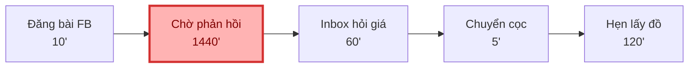
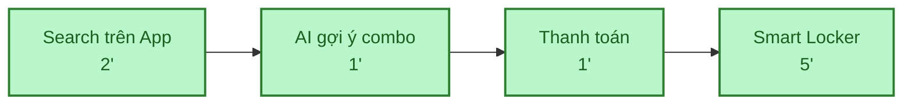
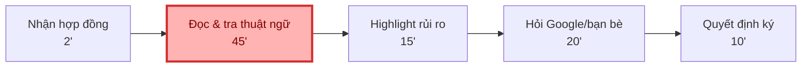
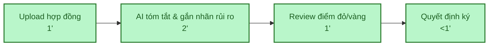
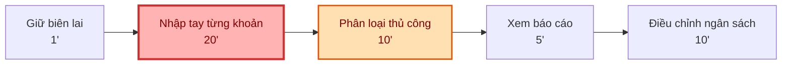
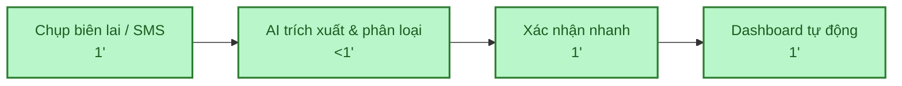

# 01 — Individual Problem Scan

## Scan rộng

Quân scan 10 problems, vượt mức tối thiểu 5.

| # | Lăng kính | Problem quan sát được | Ai đang đau? | Dấu hiệu thật |
| :--- | :--- | :--- | :--- | :--- |
| **1** | Tốn thời gian | Thuê đồ đạc ngắn hạn (lều trại, máy ảnh) gặp khó vì Việt Nam chưa có app thuê đồ tập trung, phải tìm thủ công. | Người cần thuê đồ | Mất 1-2 ngày đăng bài lên Facebook, inbox hỏi giá từng người, rủi ro lừa đảo mất tiền cọc cao. |
| **2** | AI có thể tốt hơn | Đọc hợp đồng thuê nhà hoặc điều khoản dịch vụ (ToS) dài 5-7 trang toàn chữ. | Người thuê nhà / Người dùng | Mất 30 phút đọc nhưng không hiểu các từ ngữ pháp lý, đành ký bừa rồi mang cục tức nếu có tranh chấp. |
| **3** | Lặp lại | Ghi chép chi tiêu hàng ngày vào app quản lý tài chính nhưng lười, hay quên. | Sinh viên / Người đi làm | Cuối tháng nhìn số dư trong bank lệch hẳn so với app, tra lại không nhớ mình đã tiêu khoản gì. |
| **4** | Pain từ người khác | Hẹn lịch họp nhóm bài tập hoặc đi chơi mà mỗi đứa rảnh một khung giờ khác nhau. | Trưởng nhóm / Người tổ chức | Chat qua lại mấy chục tin nhắn trong group chat, cãi nhau cả buổi vẫn chưa chốt được ngày. |
| **5** | Tốn thời gian | Chia tiền ăn uống, đi chơi cho nhóm đông (người chuyển khoản, người đưa tiền mặt, người trả hộ). | Người đứng ra thanh toán | Ngồi lướt lịch sử bank, cộng trừ nhân chia mất 30 phút. Cuối cùng tính sai vẫn bị hụt tiền. |
| **6** | Pain từ người khác | Bố mẹ ở quê gọi điện nhờ sửa lỗi điện thoại/TV nhưng chỉ miêu tả "nó hiện cái bảng gì ấy". | Con cái / Người trẻ | Phải video call, chỉ từng nút bấm qua màn hình rất mờ, mất 20-30 phút mới xong một lỗi vặt. |
| **7** | AI có thể tốt hơn | Tìm lại một email hoặc file tài liệu cũ lẫn trong đống mail quảng cáo, spam. | Sinh viên / Dân văn phòng | Gõ keyword vào ô search mà nó ra hàng loạt mail không liên quan. Lướt tìm mất 15 phút. |
| **8** | Tốn thời gian | So sánh giá, check xem review nào là thật trên Shopee/Lazada trước khi mua đồ điện tử. | Người mua hàng online | Lướt qua 4-5 shop, đọc comment mỏi mắt mất hơn 1 tiếng đồng hồ mà vẫn sợ mua nhầm hàng rởm. |
| **9** | Lặp lại | Nghĩ xem "hôm nay ăn gì" dựa trên mớ nguyên liệu linh tinh còn sót lại trong tủ lạnh. | Sinh viên ở trọ / Nội trợ | Mở tủ lạnh đứng nhìn 15 phút mỗi chiều, lướt Tóp Tóp tìm công thức mất thêm 20 phút nữa. |
| **10** | Tốn thời gian | Điền form xin nghỉ phép bằng giấy/Word rồi chạy đi xin chữ ký các sếp. | Nhân viên văn phòng | Cầm tờ giấy chạy 2-3 phòng ban. Sếp đi họp là đơn bị ngâm cả tuần, mất công chat hỏi liên tục. |

Vì sao phần scan này mạnh:
- Có scan rộng trước khi hội tụ.
- Có nhiều lăng kính khác nhau.
- Mỗi problem có actor và dấu hiệu thật.
- Không bắt đầu bằng "làm chatbot" hoặc "xây agent".

## Top 3

| Rank | Problem | Vì sao chọn | Điều còn chưa chắc |
| :--- | :--- | :--- | :--- |
| 1 | Thuê đồ đạc ngắn hạn (Rento) | Workflow tìm đồ -> hỏi giá -> cọc rất rõ. Nỗi đau lớn (mất thời gian, mất tiền). | Bài toán xây dựng Platform, không thuần AI-first. Cần xác định rõ AI sẽ nằm ở bước nào. |
| 2 | Đọc hợp đồng/ToS | Hợp thế mạnh xử lý ngôn ngữ AI. Metric đo đạc rõ ràng (30 phút -> 2 phút). | Rủi ro pháp lý cao, ảo tưởng (hallucination) có thể làm người dùng thiệt hại. |
| 3 | Quản lý chi tiêu | Vấn đề lặp lại hàng ngày. AI trích xuất biên lai tốt hơn nhiều so với thủ công. | Rủi ro bảo mật (đọc SMS/Banking). Mức độ chính xác nếu ảnh mờ/viết tắt. |

#  Problem Card #1 — Thuê đồ đạc ngắn hạn (Rento)

## Problem

> Người có nhu cầu thuê đồ đạc ngắn hạn mất 1–2 ngày tìm kiếm trên Facebook, phải hỏi giá thủ công và chịu rủi ro lừa đảo tiền cọc cao.

---

## Actor

Người cần thuê đồ ngắn hạn — sinh viên, người đi làm.

## Bối cảnh

Khi cần đồ đạc (máy ảnh, lều trại, ...) cho một sự kiện nhưng mua đứt thì lãng phí.

---

## Current Workflow

| # | Bước | Thời gian |
|---|------|-----------|
| 1 | Đăng bài lên group Facebook | 10' |
| 2 |  **Chờ người cho thuê thấy bài và phản hồi** | **1440'** |
| 3 | Inbox hỏi giá, thương lượng | 60' |
| 4 | Chuyển cọc thủ công | 5' |
| 5 | Hẹn điểm lấy đồ | 120' |
| | **Tổng** | **1635'** |

---

## Bottleneck

**Bước 2** — chờ người cho thuê thấy bài và phản hồi mất **1440 phút** (1–2 ngày), rủi ro mất cọc **100%** nếu gặp lừa đảo.

---

## Impact

-  Mất 1–2 ngày chỉ để chốt thuê một món đồ
-  Tỉ lệ bị lừa đảo cọc cao, không có cơ chế bảo vệ
-  Trải nghiệm thuê đồ rất tệ, thiếu tin tưởng

---

## Success Metrics

| Chỉ số | Hiện tại | Mục tiêu |
|--------|----------|----------|
| Thời gian từ tìm  chốt thuê | 1–2 ngày | **< 5 phút** |
| Tỉ lệ giao dịch an toàn | Thấp | **100%** |

---

## Non-AI Alternative

Xây dựng **nền tảng trung gian** kết hợp **Smart Locker**, công khai giá niêm yết và giữ tiền cọc qua hệ thống — không cần AI vẫn giải quyết được bottleneck chính.

## AI Hypothesis

> AI phân tích nhu cầu và giỏ hàng để **tự động gợi ý combo đồ liên quan**
> — ví dụ: thuê máy ảnh  gợi ý thêm pin dự phòng, túi đựng.

**Quick gut:** Giải pháp cốt lõi nằm ở **Workflow**, AI là lớp giá trị thêm phía trên.

---

## Workflow Comparison

### Current State — 1635 phút

```
Đăng bài FB (10')  [ Chờ phản hồi 1440']  Inbox hỏi giá (60')  Chuyển cọc (5')  Hẹn lấy đồ (120')
```

### Future State — 9 phút

```
Search App (2')  AI gợi ý combo (1')  Thanh toán (1')  Smart Locker (5')
```

>  **Giảm 99.4% thời gian chờ. Giao dịch an toàn 100%.**#  Problem Card #1 — Thuê đồ đạc ngắn hạn (Rento)

## Problem

> Người có nhu cầu thuê đồ đạc ngắn hạn mất 1–2 ngày tìm kiếm trên Facebook, phải hỏi giá thủ công và chịu rủi ro lừa đảo tiền cọc cao.

---

## Actor

Người cần thuê đồ ngắn hạn — sinh viên, người đi làm.

## Bối cảnh

Khi cần đồ đạc (máy ảnh, lều trại, ...) cho một sự kiện nhưng mua đứt thì lãng phí.

---

## Current Workflow

| # | Bước | Thời gian |
|---|------|-----------|
| 1 | Đăng bài lên group Facebook | 10' |
| 2 |  **Chờ người cho thuê thấy bài và phản hồi** | **1440'** |
| 3 | Inbox hỏi giá, thương lượng | 60' |
| 4 | Chuyển cọc thủ công | 5' |
| 5 | Hẹn điểm lấy đồ | 120' |
| | **Tổng** | **1635'** |

---

## Bottleneck

**Bước 2** — chờ người cho thuê thấy bài và phản hồi mất **1440 phút** (1–2 ngày), rủi ro mất cọc **100%** nếu gặp lừa đảo.

---

## Impact

-  Mất 1–2 ngày chỉ để chốt thuê một món đồ
-  Tỉ lệ bị lừa đảo cọc cao, không có cơ chế bảo vệ
-  Trải nghiệm thuê đồ rất tệ, thiếu tin tưởng

---

## Success Metrics

| Chỉ số | Hiện tại | Mục tiêu |
|--------|----------|----------|
| Thời gian từ tìm  chốt thuê | 1–2 ngày | **< 5 phút** |
| Tỉ lệ giao dịch an toàn | Thấp | **100%** |

---

## Non-AI Alternative

Xây dựng **nền tảng trung gian** kết hợp **Smart Locker**, công khai giá niêm yết và giữ tiền cọc qua hệ thống — không cần AI vẫn giải quyết được bottleneck chính.

## AI Hypothesis

> AI phân tích nhu cầu và giỏ hàng để **tự động gợi ý combo đồ liên quan**
> — ví dụ: thuê máy ảnh  gợi ý thêm pin dự phòng, túi đựng.

**Quick gut:** Giải pháp cốt lõi nằm ở **Workflow**, AI là lớp giá trị thêm phía trên.

---

## Workflow Comparison

### Current State — 1635 phút



### Future State — 9 phút



>  **Giảm 99.4% thời gian chờ. Giao dịch an toàn 100%.**

---
---

#  Problem Card #2 — Đọc hợp đồng / ToS

## Problem

> Người dùng phổ thông mất 30–60 phút đọc một hợp đồng hoặc điều khoản dịch vụ dài, không hiểu hết thuật ngữ pháp lý và dễ bỏ sót các điều khoản bất lợi.

---

## Actor

Người dùng cá nhân — freelancer, sinh viên, người đi làm ký hợp đồng lao động, hợp đồng thuê nhà, hoặc đồng ý ToS khi đăng ký dịch vụ.

## Bối cảnh

Khi cần ký hợp đồng hoặc chấp nhận điều khoản dịch vụ nhưng không có nền tảng pháp lý, không có tiền thuê luật sư cho các vụ việc nhỏ.

---

## Current Workflow

| # | Bước | Thời gian |
|---|------|-----------|
| 1 | Nhận / tải hợp đồng về | 2' |
| 2 |  **Đọc toàn bộ văn bản, tra từng thuật ngữ** | **45'** |
| 3 | Highlight các điều khoản đáng ngờ | 15' |
| 4 | Hỏi bạn bè / Google để hiểu nghĩa | 20' |
| 5 | Quyết định ký hoặc thương lượng | 10' |
| | **Tổng** | **92'** |

---

## Bottleneck

**Bước 2** — đọc và hiểu văn bản pháp lý dài, ngôn ngữ chuyên môn, mất **45 phút** và vẫn có nguy cơ bỏ sót điều khoản bất lợi ẩn sâu trong tài liệu.

---

## Impact

-  Mất gần 1,5 tiếng cho một hợp đồng đơn giản
-  Dễ bỏ qua điều khoản phạt, tự động gia hạn, giới hạn trách nhiệm
-  Cảm giác bất an khi ký vì không chắc mình hiểu đúng

---

## Success Metrics

| Chỉ số | Hiện tại | Mục tiêu |
|--------|----------|----------|
| Thời gian hiểu nội dung hợp đồng | ~45 phút | **< 2 phút** |
| Tỉ lệ phát hiện điều khoản rủi ro | Thấp (dựa vào may mắn) | **> 90%** |

---

## Non-AI Alternative

Xây dựng thư viện template hợp đồng chuẩn hoá kèm chú thích từng điều khoản — người dùng so sánh hợp đồng nhận được với template để phát hiện điểm khác biệt.

## AI Hypothesis

> AI đọc toàn bộ hợp đồng và **tóm tắt các điều khoản quan trọng, gắn nhãn mức độ rủi ro** (xanh / vàng / đỏ), dịch thuật ngữ pháp lý sang ngôn ngữ thông thường trong dưới 2 phút.

**Quick gut:** Đây là **thế mạnh cốt lõi** của AI xử lý ngôn ngữ — metric đo đạc rõ ràng. Rủi ro chính là hallucination có thể khiến người dùng bỏ sót điều khoản quan trọng hoặc hiểu sai nghĩa pháp lý.

---

## Workflow Comparison

### Current State — 92 phút



### Future State — 4 phút



>  **Giảm 95% thời gian đọc hợp đồng. Rủi ro pháp lý được highlight tự động.**

---
---

#  Problem Card #3 — Quản lý chi tiêu

## Problem

> Người dùng mất 15–30 phút mỗi tuần nhập tay biên lai và phân loại chi tiêu, dễ bỏ sót giao dịch và không có cái nhìn tổng quan kịp thời về tài chính cá nhân.

---

## Actor

Người đi làm, sinh viên — ai có nhu cầu kiểm soát chi tiêu cá nhân hàng ngày nhưng không muốn dùng phần mềm phức tạp.

## Bối cảnh

Sau mỗi lần mua sắm, ăn uống hoặc thanh toán, người dùng cần ghi lại để theo dõi ngân sách tháng — nhưng thủ công quá mệt nên hay bỏ giữa chừng.

---

## Current Workflow

| # | Bước | Thời gian |
|---|------|-----------|
| 1 | Giữ lại biên lai giấy / ảnh chụp | 1' |
| 2 |  **Nhập tay từng khoản vào app/spreadsheet** | **20'/tuần** |
| 3 | Phân loại danh mục (ăn uống, đi lại, ...) | 10'/tuần |
| 4 | Xem báo cáo cuối tháng | 5' |
| 5 | Điều chỉnh ngân sách tháng sau | 10' |
| | **Tổng** | **~46'/tuần** |

---

## Bottleneck

**Bước 2 & 3** — nhập tay và phân loại thủ công tốn **30 phút/tuần**, dễ sai sót với tên viết tắt, hình ảnh mờ, và người dùng thường bỏ cuộc sau 2–3 tuần vì quá tẻ nhạt.

---

## Impact

-  ~2 tiếng/tháng chỉ để nhập số liệu thủ công
-  Tỉ lệ bỏ cuộc cao — thói quen không duy trì được
-  Báo cáo không chính xác do bỏ sót giao dịch nhỏ

---

## Success Metrics

| Chỉ số | Hiện tại | Mục tiêu |
|--------|----------|----------|
| Thời gian nhập liệu mỗi tuần | ~30 phút | **< 2 phút** |
| Tỉ lệ giao dịch được ghi nhận | ~70% (bỏ sót) | **> 95%** |
| Tỉ lệ duy trì thói quen sau 1 tháng | Thấp | **> 80%** |

---

## Non-AI Alternative

Tích hợp trực tiếp với SMS banking và Open Banking API để tự động import giao dịch — không cần AI, không cần nhập tay.

## AI Hypothesis

> AI nhận ảnh chụp biên lai hoặc đọc SMS banking để **tự động trích xuất số tiền, danh mục, ngày giờ** và cập nhật vào bảng chi tiêu mà không cần người dùng nhập tay.

**Quick gut:** Vấn đề lặp lại hàng ngày, AI trích xuất ảnh tốt hơn nhiều so với thủ công. Rủi ro chính là **bảo mật** (quyền đọc SMS/Banking) và độ chính xác khi ảnh mờ hoặc viết tắt không chuẩn.

---

## Workflow Comparison

### Current State — 46 phút/tuần



### Future State — 3 phút/tuần



>  **Giảm 93% thời gian nhập liệu. Thói quen dễ duy trì hơn.**
